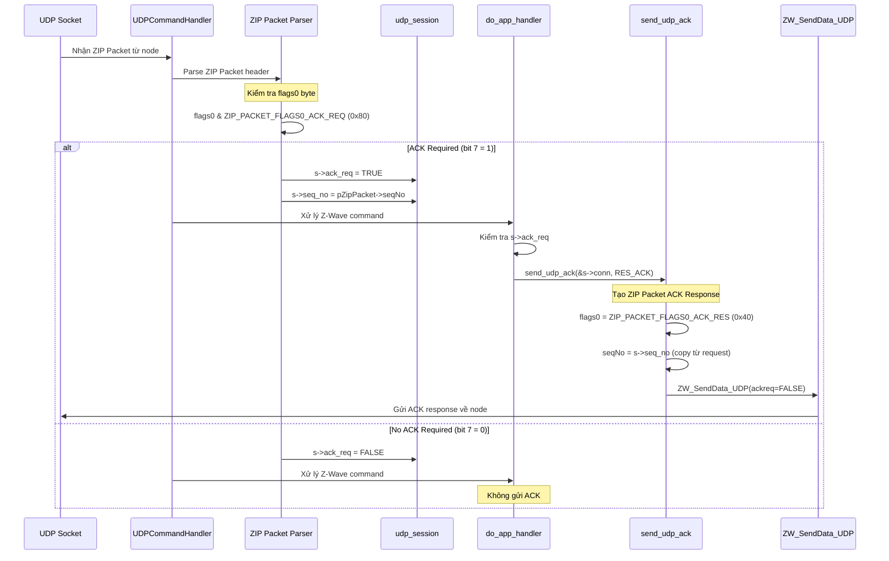
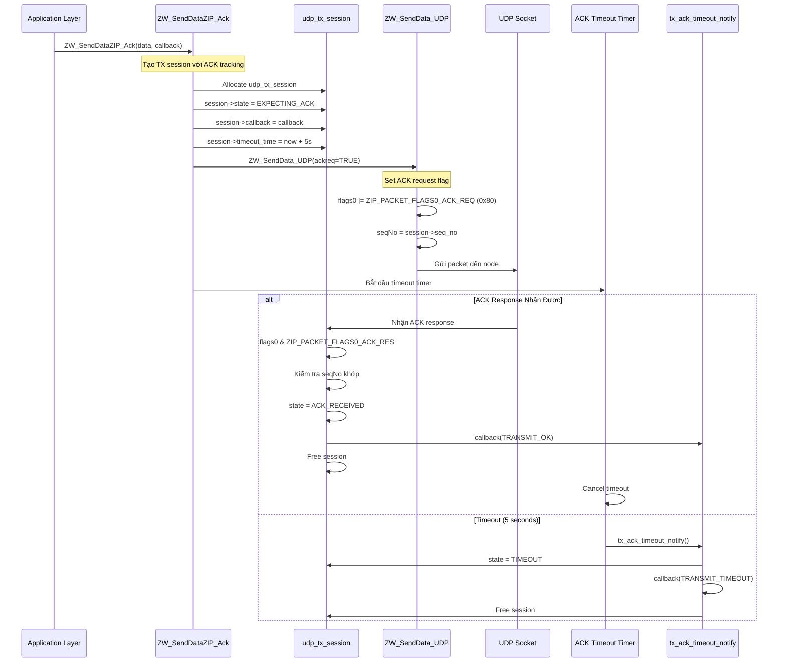
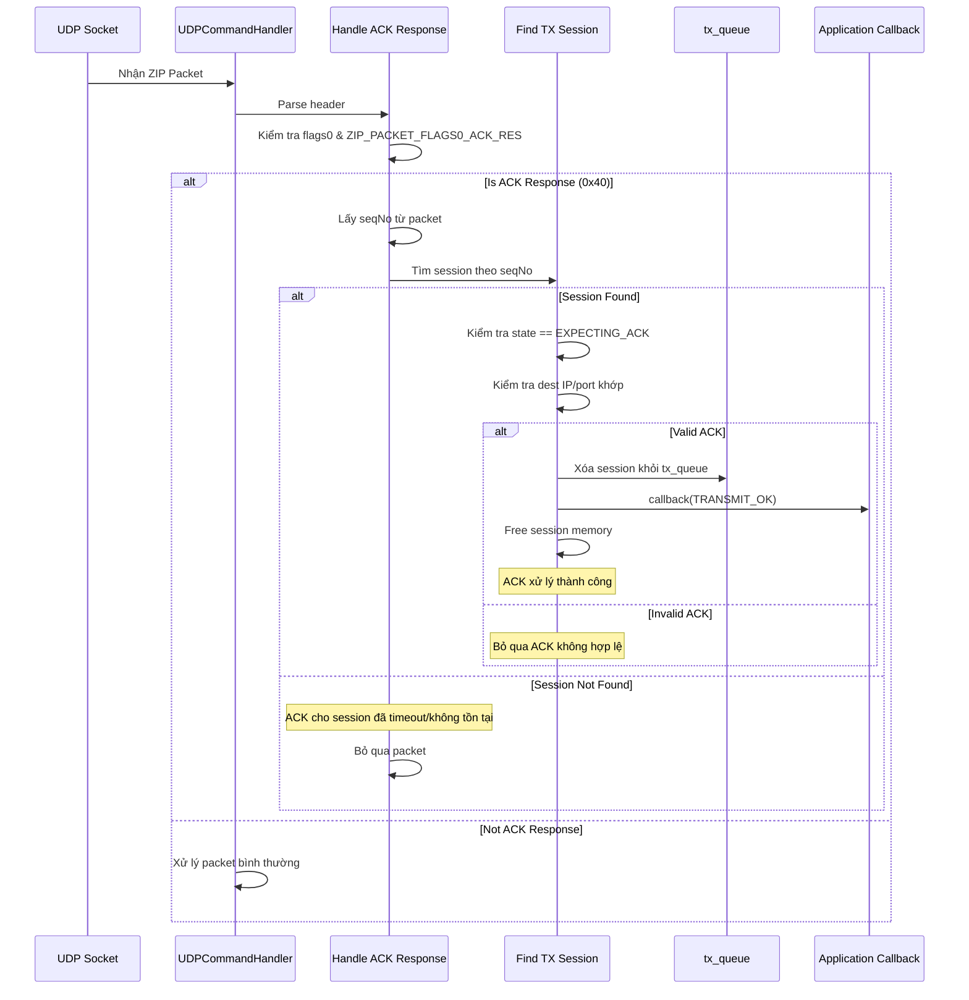
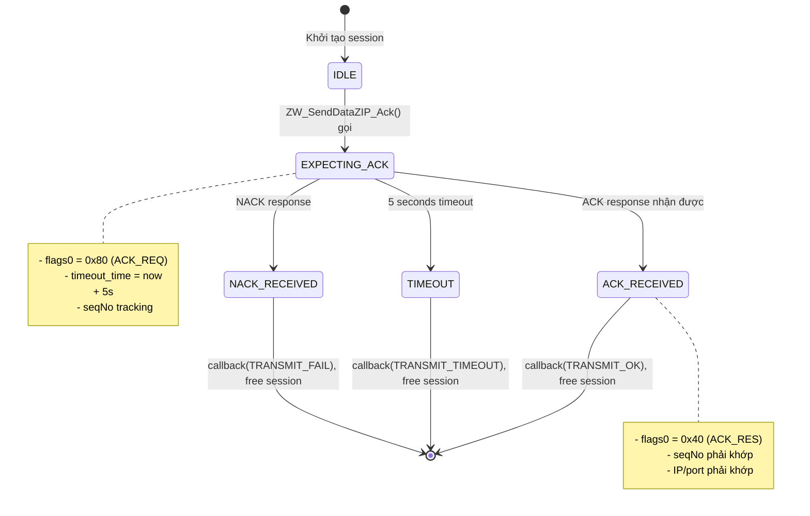

# Cách nhận biết gói tin yêu cầu ACK và trace đến ZW_SendDataZIP_Ack

Tài liệu này giải thích chi tiết cách Z/IP Gateway nhận biết một gói tin đến có yêu cầu ACK (Acknowledge) hay không, và truy nguyên luồng xử lý dẫn đến việc gọi hàm `ZW_SendDataZIP_Ack`.

## 1. Định nghĩa flag ACK_REQ trong ZIP Packet

Trong file `src/ZW_zip_classcmd.h`, các flag được định nghĩa cho ZIP Packet:

```c
#define ZIP_PACKET_FLAGS0_ACK_REQ  0x80   // Bit 7: Yêu cầu ACK
#define ZIP_PACKET_FLAGS0_ACK_RES  0x40   // Bit 6: ACK Response
#define ZIP_PACKET_FLAGS0_NACK_RES 0x20   // Bit 5: NACK Response
#define ZIP_PACKET_FLAGS0_NACK_WAIT (1<<4) // Bit 4: Waiting
#define ZIP_PACKET_FLAGS0_NACK_QF   (1<<3) // Bit 3: Queue full
#define ZIP_PACKET_FLAGS0_NACK_OERR (1<<2) // Bit 2: Option error
```

**Cấu trúc ZIP Packet:**
```c
typedef struct _ZW_COMMAND_ZIP_PACKET_ {
  BYTE cmdClass;         // COMMAND_CLASS_ZIP
  BYTE cmd;              // COMMAND_ZIP_PACKET
  BYTE flags0;           // ← Byte này chứa ACK_REQ flag
  BYTE flags1;           // Flags khác (header ext, ZW cmd, secure origin...)
  BYTE seqNo;            // Sequence number
  BYTE sEndpoint;        // Source endpoint
  BYTE dEndpoint;        // Destination endpoint
  BYTE payload[...];     // Payload thực tế
} ZW_COMMAND_ZIP_PACKET;
```

**Giải thích:**
- `flags0` byte thứ 3 trong ZIP Packet chứa các flag điều khiển.
- Bit 7 (0x80) của `flags0` = `ZIP_PACKET_FLAGS0_ACK_REQ` → nếu bit này được set = 1, gói tin yêu cầu ACK.

## 2. Flow nhận và xử lý gói tin UDP

### 2.1 Điểm vào: `UDPCommandHandler` (`ZW_udp_server.c`)

```c
void UDPCommandHandler(struct uip_udp_conn* c,
                      const u8_t* data, 
                      u16_t len,
                      u8_t received_secure) 
{
  ZW_COMMAND_ZIP_PACKET* pZipPacket = (ZW_COMMAND_ZIP_PACKET*) data;
  
  // ... parsing logic ...
  
  // Kiểm tra xem có phải ZIP_PACKET không
  if (pZipPacket->cmdClass == COMMAND_CLASS_ZIP && 
      pZipPacket->cmd == COMMAND_ZIP_PACKET) 
  {
    // ===== BƯỚC 1: Kiểm tra ACK_REQ flag =====
    if (pZipPacket->flags0 & ZIP_PACKET_FLAGS0_ACK_REQ) 
    {
      // Frame này yêu cầu ACK
      // ... (sẽ xử lý sau)
    }
```

**Giải thích:**
- Khi nhận UDP packet, hàm cast data thành `ZW_COMMAND_ZIP_PACKET*`.
- Kiểm tra `flags0` với bitwise AND `&` để xác định bit ACK_REQ có được set hay không.
- Nếu `(pZipPacket->flags0 & ZIP_PACKET_FLAGS0_ACK_REQ) != 0` → gói tin yêu cầu ACK.

### 2.2 Lưu trạng thái ACK_REQ vào async_state

Sau khi parse packet, gateway lưu metadata vào queue để xử lý async:

```c
// Tạo queue entry cho packet này
p = uip_packetqueue_alloc(&async_queue,
    (u8_t*) payload - sizeof(struct async_state),
    sizeof(struct async_state) + udp_payload_len, 1000);

s = (struct async_state*) p->queue_buf;

// ... copy connection info ...

// ===== BƯỚC 2: Lưu flag ACK_REQ =====
s->ack_req = pZipPacket->flags0 & ZIP_PACKET_FLAGS0_ACK_REQ;

// Lưu payload (Z-Wave command) vào queue
// Sau đó gọi handler
if (tmp_flags1 & ZIP_PACKET_FLAGS1_ZW_CMD_INCL) 
{
  if (isMulticast) {
    s->ack_req = 0; // Multicast không ACK
    ctimer_set(&zw_udp_timer, random_rand() & 0x1af, do_app_handler, 0);
  } else {
    do_app_handler();
  }
}
```

**Giải thích:**
- `struct async_state` chứa metadata cho mỗi packet trong queue.
- `s->ack_req` lưu giá trị của flag ACK_REQ (0 hoặc 0x80).
- Multicast frame luôn set `ack_req = 0` vì không ACK multicast.
- Unicast frame giữ nguyên giá trị để `do_app_handler` sử dụng.

### 2.3 Xử lý và gửi ACK: `do_app_handler`

```c
static void do_app_handler() 
{
  struct async_state *s;
  u16_t udp_payload_len;

  while (uip_packetqueue_buflen(&async_queue)) 
  {
    s = (struct async_state*) uip_packetqueue_buf(&async_queue);
    udp_payload_len = uip_packetqueue_buflen(&async_queue) 
                      - sizeof(struct async_state);

    // ===== BƯỚC 3: Gửi ACK trước khi xử lý command =====
    if (s->ack_req) 
    {
      send_udp_ack(&s->conn, RES_ACK);
    }
    
    // ===== BƯỚC 4: Xử lý Z-Wave command =====
    ApplicationIpCommandHandler(&s->conn,
        (BYTE*) s + sizeof(struct async_state), 
        udp_payload_len);

    uip_packetqueue_pop(&async_queue);
  }
}
```

**Giải thích từng bước:**
1. Lấy packet đầu tiên từ `async_queue`.
2. Kiểm tra `s->ack_req` (đã lưu từ bước 2.2).
3. **Nếu `s->ack_req != 0`**: Gọi `send_udp_ack(&s->conn, RES_ACK)` **trước** khi xử lý command.
4. Sau khi gửi ACK, mới forward command đến `ApplicationIpCommandHandler` để xử lý logic ứng dụng.
5. Loại bỏ packet khỏi queue.

**Lý do gửi ACK trước:**
- ACK phải được gửi ngay để client biết packet đã đến.
- Xử lý command có thể mất thời gian → không để client timeout.

## 3. Tạo và gửi ACK Response: `send_udp_ack`

```c
void send_udp_ack(zwave_udp_session_t* s, zwave_udp_response_t res)
{
  // ===== BƯỚC 3.1: Tạo ACK packet =====
  ZW_COMMAND_ZIP_PACKET ack = {
    COMMAND_CLASS_ZIP,              // cmdClass
    COMMAND_ZIP_PACKET,             // cmd
    ZIP_PACKET_FLAGS0_ACK_RES,     // flags0 ← ACK Response flag
    0,                              // flags1
    0,                              // seqNo (sẽ cập nhật)
    0,                              // sEndpoint (sẽ cập nhật)
    0,                              // dEndpoint (sẽ cập nhật)
  };

  // ===== BƯỚC 3.2: Copy thông tin session =====
  ack.seqNo = s->seq;            // Dùng cùng seq# với request
  ack.dEndpoint = s->rendpoint;  // Đổi chiều endpoint
  ack.sEndpoint = s->lendpoint;

  // ===== BƯỚC 3.3: Set response type =====
  switch (res) {
    case RES_ACK:
      ack.flags0 = ZIP_PACKET_FLAGS0_ACK_RES;
      ack.flags1 = 0;
      break;
    case RES_NAK:
      ack.flags0 = ZIP_PACKET_FLAGS0_NACK_RES;
      ack.flags1 = 0;
      break;
    case RES_WAITNG:
      ack.flags0 = ZIP_PACKET_FLAGS0_NACK_RES | ZIP_PACKET_FLAGS0_NACK_WAIT;
      ack.flags1 = 0;
      break;
    case RES_OPT_ERR:
      ack.flags0 = ZIP_PACKET_FLAGS0_NACK_RES | ZIP_PACKET_FLAGS0_NACK_OERR;
      ack.flags1 = 0;
      break;
  }

  // ===== BƯỚC 3.4: Gửi ACK qua UDP =====
  udp_send_wrap(&s->conn, &ack, ZIP_HEADER_SIZE, 0, 0);
}
```

**Giải thích chi tiết:**
1. Tạo ZIP Packet ACK với `flags0 = ZIP_PACKET_FLAGS0_ACK_RES` (0x40).
2. Copy `seqNo` từ request để client match được ACK với request gốc.
3. Đổi chiều endpoint: `sEndpoint` trở thành `dEndpoint` và ngược lại.
4. Chỉ gửi ZIP header (không có payload) → packet nhỏ, nhanh.
5. `udp_send_wrap` gửi qua DTLS hoặc plain UDP tuỳ cấu hình.

## 4. Kết nối với `ZW_SendDataZIP_Ack`

Hàm `ZW_SendDataZIP_Ack` được dùng khi **gateway gửi request** và yêu cầu ACK từ phía bên kia (LAN client hoặc unsolicited destination).

### 4.1 Khi nào gọi `ZW_SendDataZIP_Ack`?

Khi gateway muốn gửi một Z-Wave command đến LAN client **và yêu cầu ACK**:

```c
void ZW_SendDataZIP_ack(zwave_connection_t *c,
                        const void *dataptr, 
                        u8_t datalen, 
                        void (*cbFunc)(u8_t, void*, TX_STATUS_TYPE *))
{
  if (ZW_IsZWAddr(&c->ripaddr)) 
  {
    // ===== Nếu đích là Z-Wave node =====
    ts_param_t p;
    ts_set_std(&p, c->ripaddr.u8[0]);
    p.scheme = c->scheme;
    
    // Gửi qua Z-Wave Serial API
    if (!ZW_SendDataAppl(&p, dataptr, datalen & 0xFF, cbFunc, 0) && cbFunc) {
      cbFunc(TRANSMIT_COMPLETE_FAIL, 0, NULL);
    }
  } 
  else 
  {
    // ===== Nếu đích là IP address =====
    struct udp_tx_session *s;
    s = memb_alloc(&udp_tx_sessions_memb);
    
    if (s) {
      // Tạo TX session để track ACK
      s->seq = seqNo;
      uip_ipaddr_copy(&s->dst_ip, &c->ripaddr);
      uip_ipaddr_copy(&s->src_ip, &c->lipaddr);
      s->dst_port = c->rport;
      s->cb = cbFunc;              // Callback khi nhận ACK
      s->src_ep = c->lendpoint;
      s->dst_ep = c->rendpoint;
      s->user = 0;
      
      list_add(udp_tx_sessions_list, s);
      
      // ===== Set timeout cho ACK =====
      ctimer_set(&s->timeout, CLOCK_CONF_SECOND, ack_session_timeout, s);
      
      // ===== Gửi ZIP Packet với ACK_REQ flag =====
      ZW_SendData_UDP(c, dataptr, datalen, cb_udp_send_done, (void *)s, TRUE);
      //                                                                   ^^^^
      //                                                           ackreq = TRUE
    } else {
      if (cbFunc) {
        cbFunc(TRANSMIT_COMPLETE_FAIL, 0, NULL);
      }
    }
  }
}
```

**Giải thích:**
1. Phân biệt đích là Z-Wave node (qua Serial API) hay IP address (qua UDP).
2. Với IP destination:
   - Tạo `udp_tx_session` để track việc đợi ACK.
   - Set timeout timer: nếu không nhận ACK trong 1 giây → gọi `ack_session_timeout`.
   - Gọi `ZW_SendData_UDP` với `ackreq = TRUE` → hàm này sẽ set bit `ZIP_PACKET_FLAGS0_ACK_REQ` trong packet gửi đi.

### 4.2 Set ACK_REQ flag khi gửi: `ZW_SendData_UDP`

```c
static void ZW_SendData_UDP(zwave_connection_t *c,
                           const void *dataptr,
                           u16_t datalen,
                           void (*cb)(BYTE, void *),
                           void *user,
                           BOOL ackreq)  // ← Tham số yêu cầu ACK
{
  // ... tạo ZIP Packet ...
  
  // ===== Set ACK_REQ flag nếu yêu cầu =====
  pZipPacket->flags0 = ackreq ? ZIP_PACKET_FLAGS0_ACK_REQ : 0;
  
  // ... copy payload, header extensions ...
  
  // Gửi packet
  udp_send_wrap(c, buf, len, cb, user);
}
```

**Giải thích:**
- Nếu `ackreq = TRUE` → `flags0` được set bit 7 (0x80).
- Client nhận packet này sẽ thấy `ZIP_PACKET_FLAGS0_ACK_REQ` và biết phải gửi ACK.

### 4.3 Nhận ACK Response

Khi client gửi ACK về, gateway nhận trong `UDPCommandHandler`:

```c
// Trong UDPCommandHandler
if (pZipPacket->flags0 & ZIP_PACKET_FLAGS0_ACK_RES) 
{
  // ===== Đây là ACK Response =====
  struct udp_tx_session *s;
  
  // Tìm session tương ứng với seqNo và IP
  for (s = list_head(udp_tx_sessions_list); s; s = list_item_next(s)) {
    if (s->seq == pZipPacket->seqNo && 
        uip_ipaddr_cmp(&s->dst_ip, &UIP_IP_BUF->srcipaddr)) 
    {
      // ===== Match! =====
      ctimer_stop(&s->timeout);  // Huỷ timeout timer
      
      if (s->cb) {
        s->cb(TRANSMIT_COMPLETE_OK, s->user, NULL); // Gọi callback thành công
      }
      
      list_remove(udp_tx_sessions_list, s);
      memb_free(&udp_tx_sessions_memb, s);
      break;
    }
  }
  return; // Không xử lý thêm vì đây chỉ là ACK
}
```

**Giải thích:**
1. Kiểm tra `flags0 & ZIP_PACKET_FLAGS0_ACK_RES` để nhận diện ACK.
2. Match ACK với TX session dựa trên `seqNo` và source IP.
3. Huỷ timeout timer (không còn cần đợi nữa).
4. Gọi callback với status `TRANSMIT_COMPLETE_OK`.
5. Giải phóng session.

## 5. Flow đầy đủ (Request → ACK)

```
┌─────────────┐                                    ┌─────────────┐
│  Gateway    │                                    │  LAN Client │
│  (Sender)   │                                    │ (Receiver)  │
└──────┬──────┘                                    └──────┬──────┘
       │                                                  │
       │  1. Gọi ZW_SendDataZIP_Ack()                   │
       │     (với ackreq = TRUE)                         │
       │                                                  │
       │  2. Tạo ZIP Packet:                             │
       │     flags0 = ZIP_PACKET_FLAGS0_ACK_REQ (0x80)  │
       │     seqNo = X                                   │
       │                                                  │
       │  3. Gửi qua UDP ─────────────────────────────> │
       │                                                  │
       │  4. Tạo udp_tx_session                          │ 5. UDPCommandHandler()
       │     - lưu seqNo, callback                       │    nhận packet
       │     - Set timeout timer                         │
       │                                                  │
       │                                   6. Parse:     │
       │                                      if (flags0 & ACK_REQ)
       │                                         → lưu s->ack_req = 0x80
       │                                                  │
       │                                   7. do_app_handler()
       │                                      if (s->ack_req)
       │                                         send_udp_ack(RES_ACK)
       │                                                  │
       │  8. Nhận ACK <──────────────────────────────── │
       │     (ZIP Packet:                                │
       │      flags0 = ACK_RES, seqNo = X)              │
       │                                                  │
       │  9. UDPCommandHandler() nhận ACK                │
       │     - Match session theo seqNo                  │
       │     - Stop timeout timer                        │
       │     - Gọi callback(TRANSMIT_COMPLETE_OK)        │
       │     - Free session                              │
       │                                                  │
       │ 10. ApplicationIpCommandHandler()               │
       │     xử lý Z-Wave command                        │
       │     (sau khi đã ACK)                            │
       │                                                  │
```

## 6. Edge Cases và xử lý lỗi

### 6.1 Timeout không nhận ACK

```c
static void ack_session_timeout(void* data) {
  struct udp_tx_session *s = (struct udp_tx_session*) data;

  // ===== Timeout → không nhận được ACK =====
  if (s->cb) {
    s->cb(TRANSMIT_COMPLETE_FAIL, s->user, NULL);
  }
  
  list_remove(udp_tx_sessions_list, s);
  memb_free(&udp_tx_sessions_memb, s);
}
```

**Giải thích:**
- Sau 1 giây không nhận ACK → timeout.
- Gọi callback với `TRANSMIT_COMPLETE_FAIL`.
- Giải phóng session.

### 6.2 Packet quá dài hoặc lỗi parse

```c
if (udp_payload_len + sizeof(struct async_state) > UIP_BUFSIZE) 
{
  ERR_PRINTF("UDP frame is too large.");
  
  // ===== Vẫn gửi ACK để client biết đã nhận =====
  if (pZipPacket->flags0 & ZIP_PACKET_FLAGS0_ACK_REQ) 
  {
    send_udp_ack(&ses, RES_ACK);
  }
  return; // Drop packet
}
```

**Giải thích:**
- Packet lỗi vẫn ACK để client biết đã đến (tránh retransmit vô ích).
- Nhưng không xử lý command.

### 6.3 Option error

```c
opt_error:
  if (pZipPacket->flags0 & ZIP_PACKET_FLAGS0_ACK_REQ) 
  {
    send_udp_ack(&ses, RES_OPT_ERR);
  }
  return;
```

**Giải thích:**
- Nếu có critical option không hiểu → NACK với `RES_OPT_ERR`.
- `flags0 = NACK_RES | NACK_OERR`.

### 6.4 Multicast không ACK

```c
if (isMulticast) 
{
  s->ack_req = 0; // ← Force 0
  ctimer_set(&zw_udp_timer, random_rand() & 0x1af, do_app_handler, 0);
  return;
}
```

**Giải thích:**
- Multicast không yêu cầu ACK vì nhiều receiver.
- Random delay tránh collision reply.

## 7. Tóm tắt

| Bước | Action | File/Function | Trách nhiệm |
|------|--------|---------------|-------------|
| 1 | Nhận UDP packet | `UDPCommandHandler` | Parse ZIP header |
| 2 | Kiểm tra `flags0 & ZIP_PACKET_FLAGS0_ACK_REQ` | `UDPCommandHandler` | Nhận diện yêu cầu ACK |
| 3 | Lưu `ack_req` vào `async_state` | `UDPCommandHandler` | Queue metadata |
| 4 | Gửi ACK nếu `s->ack_req != 0` | `do_app_handler` | Respond trước xử lý |
| 5 | Tạo ACK packet | `send_udp_ack` | Build response |
| 6 | Gửi ACK qua UDP | `udp_send_wrap` | Network transmission |
| 7 | Xử lý Z-Wave command | `ApplicationIpCommandHandler` | Business logic |
| --- | --- | --- | --- |
| A | Gửi request với ACK | `ZW_SendDataZIP_Ack` | Initiate với ACK_REQ |
| B | Set `flags0 = ACK_REQ` | `ZW_SendData_UDP` | Build request packet |
| C | Track session & timeout | `udp_tx_session` | Quản lý ACK waiting |
| D | Nhận ACK response | `UDPCommandHandler` | Match và callback |

## 8. Code paths chính

### RX Path (Nhận và ACK):
```
UDPCommandHandler()
  ↓
Kiểm tra: pZipPacket->flags0 & ZIP_PACKET_FLAGS0_ACK_REQ
  ↓
Lưu: s->ack_req = flags0 & ACK_REQ
  ↓
do_app_handler()
  ↓
if (s->ack_req) send_udp_ack(RES_ACK)
  ↓
ApplicationIpCommandHandler()
```

### TX Path (Gửi và đợi ACK):
```
ZW_SendDataZIP_Ack(ackreq=TRUE)
  ↓
Tạo udp_tx_session + timeout
  ↓
ZW_SendData_UDP(ackreq=TRUE)
  ↓
Set: flags0 = ZIP_PACKET_FLAGS0_ACK_REQ
  ↓
udp_send_wrap()
  ↓
... đợi ACK ...
  ↓
UDPCommandHandler() nhận ACK response
  ↓
Match session theo seqNo
  ↓
callback(TRANSMIT_COMPLETE_OK)
```

## 9. Kết luận

- **Nhận biết ACK request**: Kiểm tra bit 7 của `flags0` trong ZIP Packet header.
- **Trả lời ACK**: Gửi ngay trong `do_app_handler()` trước khi xử lý command.
- **Gửi với ACK request**: Dùng `ZW_SendDataZIP_Ack()` với tracking session và timeout.
- **Match ACK response**: Dựa trên `seqNo` và source IP address.

Cơ chế này đảm bảo reliable delivery cho các gói tin quan trọng qua UDP (vốn unreliable), đặc biệt cho LAN traffic trong Z/IP Gateway.


# Sơ Đồ Luồng ACK trong ZIP Gateway

## 1. Luồng Nhận Packet và Gửi ACK Response



## 2. Luồng Gửi Packet với Yêu Cầu ACK



## 3. Sơ Đồ Chi Tiết Xử Lý ACK Response



## 4. Sơ Đồ State Machine của TX Session



## 5. Sơ Đồ Packet Structure với ACK Flags

```
┌─────────────────────────────────────────────────────────────┐
│                      ZIP Packet Header                       │
├─────────┬─────────┬─────────┬─────────┬─────────────────────┤
│ Command │ flags0  │ flags1  │ seqNo   │   payload...        │
│ (0x02)  │         │         │         │                     │
├─────────┼─────────┼─────────┼─────────┼─────────────────────┤
│ 1 byte  │ 1 byte  │ 1 byte  │ 1 byte  │   n bytes           │
└─────────┴─────────┴─────────┴─────────┴─────────────────────┘
           │
           └──► flags0 bits:
                ┌───┬───┬───┬───┬───┬───┬───┬───┐
                │ 7 │ 6 │ 5 │ 4 │ 3 │ 2 │ 1 │ 0 │
                ├───┼───┼───┼───┼───┼───┼───┼───┤
                │ACK│ACK│HDR│SEC│ L │ M │ B │ R │
                │REQ│RES│EXT│   │ P │ E │ E │   │
                └───┴───┴───┴───┴───┴───┴───┴───┘
                 │   │
                 │   └──► Bit 6 (0x40): ACK Response
                 └──────► Bit 7 (0x80): ACK Request

┌─────────────────────────────────────────────────────────────┐
│                   Các Trường Hợp ACK                         │
├──────────────────┬──────────┬──────────┬───────────────────┤
│ Packet Type      │ flags0   │ seqNo    │ Ý Nghĩa           │
├──────────────────┼──────────┼──────────┼───────────────────┤
│ Request + ACK    │ 0x80     │ seq_X    │ Yêu cầu ACK       │
│ ACK Response     │ 0x40     │ seq_X    │ Trả lời ACK       │
│ Request no ACK   │ 0x00     │ seq_X    │ Không cần ACK     │
│ NACK Response    │ 0xC0     │ seq_X    │ Từ chối (NACK)    │
└──────────────────┴──────────┴──────────┴───────────────────┘
```

## 6. Timeline Diagram - ACK Request/Response

```
Gateway                                                    Node
   │                                                         │
   │  ZIP Packet (flags0=0x80, seqNo=42)                   │
   ├────────────────────────────────────────────────────────>│
   │  [ACK_REQ set, data payload included]                  │
   │                                                         │
   │                                      ┌─────────────────┤
   │                                      │ Process packet  │
   │                                      │ Check flags0    │
   │                                      │ bit 7 = 1?      │
   │                                      └─────────────────┤
   │                                                         │
   │  ZIP Packet (flags0=0x40, seqNo=42)                   │
   │<────────────────────────────────────────────────────────┤
   │  [ACK_RES set, no payload, same seqNo]                 │
   │                                                         │
┌──┴──┐                                                      │
│ OK! │ Callback: TRANSMIT_OK                               │
└─────┘                                                      │
   │                                                         │
   
   
   ═══════════════ Trường Hợp Timeout ═══════════════
   
Gateway                                                    Node
   │                                                         │
   │  ZIP Packet (flags0=0x80, seqNo=99)                   │
   ├────────────────────────────────────────X               │
   │  [Packet bị mất]                                       │
   │                                                         │
   │ ⏱ Timeout timer: 5 seconds                            │
   │ ⏱ ⏱ ⏱ ⏱ ⏱                                              │
   │                                                         │
┌──┴────┐                                                    │
│TIMEOUT│ Callback: TRANSMIT_TIMEOUT                        │
└───────┘                                                    │
   │                                                         │
```

## 7. Code Flow Summary

### RX Path (Nhận packet và gửi ACK):
```
UDPCommandHandler() [ZW_udp_server.c:1070]
    │
    ├─► Parse flags0 byte
    │   └─► if (flags0 & 0x80) → s->ack_req = TRUE
    │
    ├─► Store seqNo vào session
    │   └─► s->seq_no = pZipPacket->seqNo
    │
    └─► do_app_handler() [line 836]
        └─► if (s->ack_req)
            └─► send_udp_ack(&s->conn, RES_ACK)
                ├─► flags0 = 0x40 (ACK_RES)
                ├─► seqNo = s->seq_no (echo back)
                └─► ZW_SendData_UDP(ackreq=FALSE)
```

### TX Path (Gửi packet với ACK request):
```
ZW_SendDataZIP_Ack() [ZW_udp_server.c:634]
    │
    ├─► Allocate udp_tx_session
    │   ├─► session->state = EXPECTING_ACK
    │   ├─► session->callback = callback
    │   └─► session->timeout_time = now + 5000ms
    │
    ├─► ZW_SendData_UDP(ackreq=TRUE)
    │   └─► flags0 |= 0x80 (ACK_REQ)
    │
    └─► Start timeout monitoring
        │
        ├─► ACK received → callback(TRANSMIT_OK)
        └─► Timeout → callback(TRANSMIT_TIMEOUT)
```

## 8. Các Thông Số Quan Trọng

| Parameter | Value | Source File | Mô Tả |
|-----------|-------|-------------|-------|
| ACK_REQ flag | 0x80 | ZW_zip_classcmd.h | Bit 7 của flags0 |
| ACK_RES flag | 0x40 | ZW_zip_classcmd.h | Bit 6 của flags0 |
| NACK flag | 0xC0 | ZW_zip_classcmd.h | Bit 7+6 của flags0 |
| ACK timeout | 5000 ms | ZW_udp_server.c | Thời gian chờ ACK |
| seqNo range | 0-255 | ZW_zip_classcmd.h | 1 byte sequence number |
| Max retries | 0 | - | Không retry tự động |

## 9. Edge Cases và Error Handling

### Case 1: Duplicate ACK
```
Gateway nhận 2 ACK với cùng seqNo
→ ACK đầu tiên được xử lý, free session
→ ACK thứ 2 không tìm thấy session, bị bỏ qua
```

### Case 2: Late ACK (sau timeout)
```
Timeout xảy ra → callback(TRANSMIT_TIMEOUT), free session
ACK đến sau đó → Không tìm thấy session, bị bỏ qua
```

### Case 3: Wrong seqNo
```
ACK với seqNo không khớp
→ Tìm session thất bại
→ ACK bị bỏ qua
```

### Case 4: NACK Response
```
Node gửi NACK (flags0 = 0xC0)
→ callback(TRANSMIT_FAIL)
→ Free session
```

