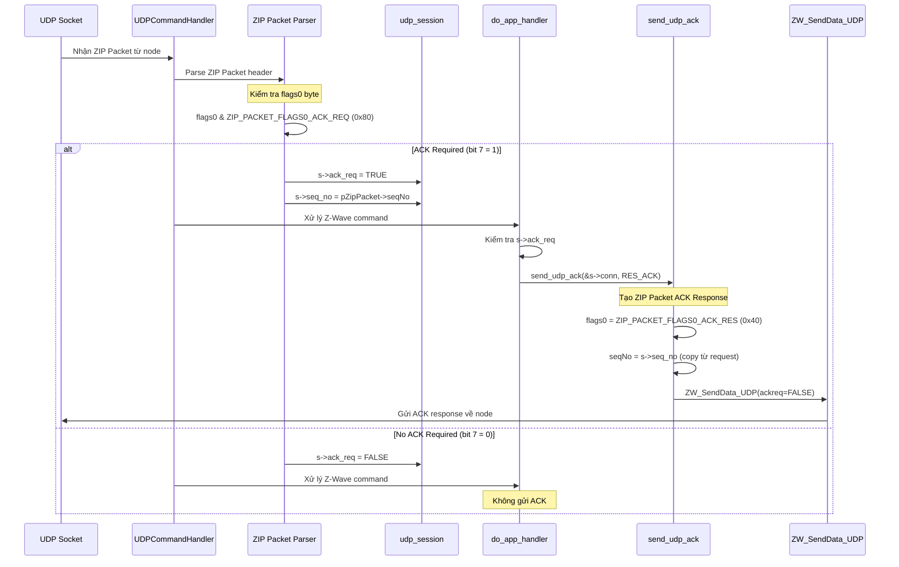
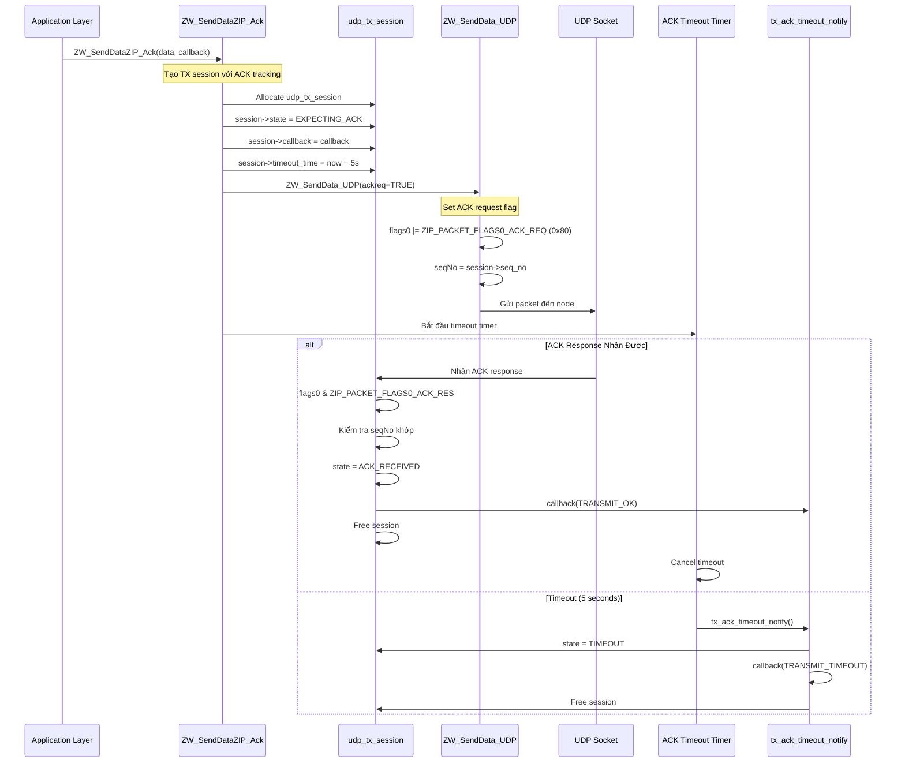
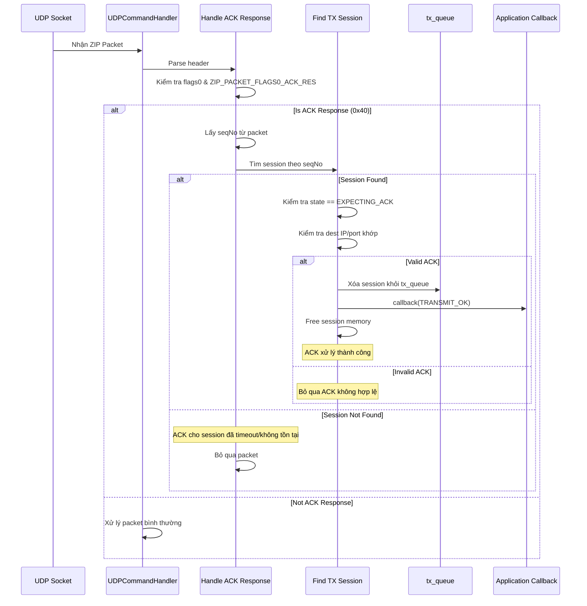
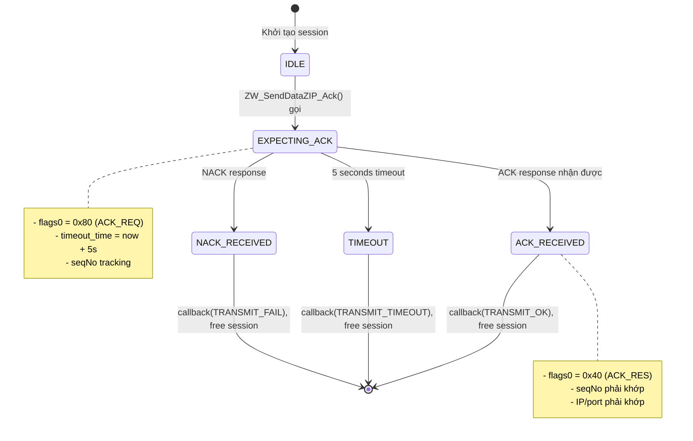
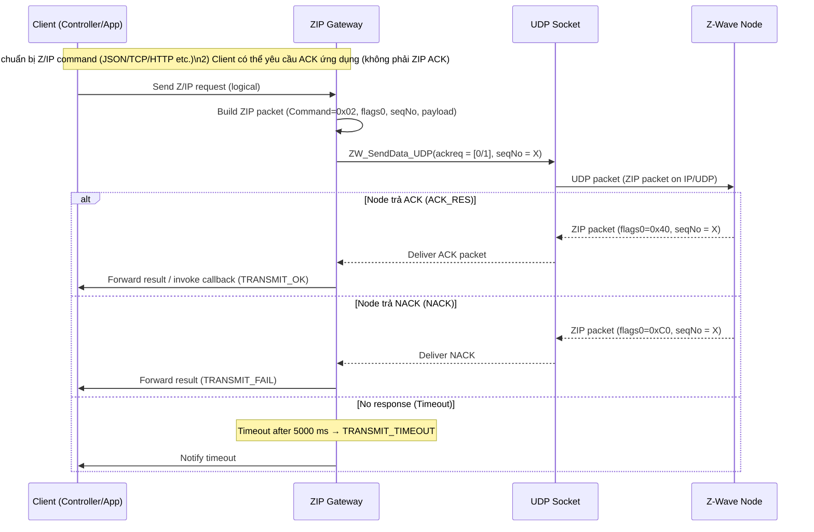
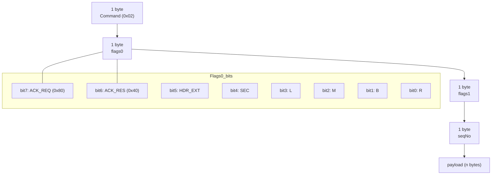

# Sơ Đồ Luồng ACK trong ZIP Gateway

## 1. Luồng Nhận Packet và Gửi ACK Response



## 2. Luồng Gửi Packet với Yêu Cầu ACK



## 3. Sơ Đồ Chi Tiết Xử Lý ACK Response



## 4. Sơ Đồ State Machine của TX Session



## 5. Sơ Đồ Packet Structure với ACK Flags

```
┌─────────────────────────────────────────────────────────────┐
│                      ZIP Packet Header                       │
├─────────┬─────────┬─────────┬─────────┬─────────────────────┤
│ Command │ flags0  │ flags1  │ seqNo   │   payload...        │
│ (0x02)  │         │         │         │                     │
├─────────┼─────────┼─────────┼─────────┼─────────────────────┤
│ 1 byte  │ 1 byte  │ 1 byte  │ 1 byte  │   n bytes           │
└─────────┴─────────┴─────────┴─────────┴─────────────────────┘
           │
           └──► flags0 bits:
                ┌───┬───┬───┬───┬───┬───┬───┬───┐
                │ 7 │ 6 │ 5 │ 4 │ 3 │ 2 │ 1 │ 0 │
                ├───┼───┼───┼───┼───┼───┼───┼───┤
                │ACK│ACK│HDR│SEC│ L │ M │ B │ R │
                │REQ│RES│EXT│   │ P │ E │ E │   │
                └───┴───┴───┴───┴───┴───┴───┴───┘
                 │   │
                 │   └──► Bit 6 (0x40): ACK Response
                 └──────► Bit 7 (0x80): ACK Request

┌─────────────────────────────────────────────────────────────┐
│                   Các Trường Hợp ACK                         │
├──────────────────┬──────────┬──────────┬───────────────────┤
│ Packet Type      │ flags0   │ seqNo    │ Ý Nghĩa           │
├──────────────────┼──────────┼──────────┼───────────────────┤
│ Request + ACK    │ 0x80     │ seq_X    │ Yêu cầu ACK       │
│ ACK Response     │ 0x40     │ seq_X    │ Trả lời ACK       │
│ Request no ACK   │ 0x00     │ seq_X    │ Không cần ACK     │
│ NACK Response    │ 0xC0     │ seq_X    │ Từ chối (NACK)    │
└──────────────────┴──────────┴──────────┴───────────────────┘
```

## 6. Timeline Diagram - ACK Request/Response

```
Gateway                                                    Node
   │                                                         │
   │  ZIP Packet (flags0=0x80, seqNo=42)                   │
   ├────────────────────────────────────────────────────────>│
   │  [ACK_REQ set, data payload included]                  │
   │                                                         │
   │                                      ┌─────────────────┤
   │                                      │ Process packet  │
   │                                      │ Check flags0    │
   │                                      │ bit 7 = 1?      │
   │                                      └─────────────────┤
   │                                                         │
   │  ZIP Packet (flags0=0x40, seqNo=42)                   │
   │<────────────────────────────────────────────────────────┤
   │  [ACK_RES set, no payload, same seqNo]                 │
   │                                                         │
┌──┴──┐                                                      │
│ OK! │ Callback: TRANSMIT_OK                               │
└─────┘                                                      │
   │                                                         │
   
   
   ═══════════════ Trường Hợp Timeout ═══════════════
   
Gateway                                                    Node
   │                                                         │
   │  ZIP Packet (flags0=0x80, seqNo=99)                   │
   ├────────────────────────────────────────X               │
   │  [Packet bị mất]                                       │
   │                                                         │
   │ ⏱ Timeout timer: 5 seconds                            │
   │ ⏱ ⏱ ⏱ ⏱ ⏱                                              │
   │                                                         │
┌──┴────┐                                                    │
│TIMEOUT│ Callback: TRANSMIT_TIMEOUT                        │
└───────┘                                                    │
   │                                                         │
```

## 7. Code Flow Summary

### RX Path (Nhận packet và gửi ACK):
```
UDPCommandHandler() [ZW_udp_server.c:1070]
    │
    ├─► Parse flags0 byte
    │   └─► if (flags0 & 0x80) → s->ack_req = TRUE
    │
    ├─► Store seqNo vào session
    │   └─► s->seq_no = pZipPacket->seqNo
    │
    └─► do_app_handler() [line 836]
        └─► if (s->ack_req)
            └─► send_udp_ack(&s->conn, RES_ACK)
                ├─► flags0 = 0x40 (ACK_RES)
                ├─► seqNo = s->seq_no (echo back)
                └─► ZW_SendData_UDP(ackreq=FALSE)
```

### TX Path (Gửi packet với ACK request):
```
ZW_SendDataZIP_Ack() [ZW_udp_server.c:634]
    │
    ├─► Allocate udp_tx_session
    │   ├─► session->state = EXPECTING_ACK
    │   ├─► session->callback = callback
    │   └─► session->timeout_time = now + 5000ms
    │
    ├─► ZW_SendData_UDP(ackreq=TRUE)
    │   └─► flags0 |= 0x80 (ACK_REQ)
    │
    └─► Start timeout monitoring
        │
        ├─► ACK received → callback(TRANSMIT_OK)
        └─► Timeout → callback(TRANSMIT_TIMEOUT)
```

## 8. Các Thông Số Quan Trọng

| Parameter | Value | Source File | Mô Tả |
|-----------|-------|-------------|-------|
| ACK_REQ flag | 0x80 | ZW_zip_classcmd.h | Bit 7 của flags0 |
| ACK_RES flag | 0x40 | ZW_zip_classcmd.h | Bit 6 của flags0 |
| NACK flag | 0xC0 | ZW_zip_classcmd.h | Bit 7+6 của flags0 |
| ACK timeout | 5000 ms | ZW_udp_server.c | Thời gian chờ ACK |
| seqNo range | 0-255 | ZW_zip_classcmd.h | 1 byte sequence number |
| Max retries | 0 | - | Không retry tự động |

## 9. Edge Cases và Error Handling

### Case 1: Duplicate ACK
```
Gateway nhận 2 ACK với cùng seqNo
→ ACK đầu tiên được xử lý, free session
→ ACK thứ 2 không tìm thấy session, bị bỏ qua
```

### Case 2: Late ACK (sau timeout)
```
Timeout xảy ra → callback(TRANSMIT_TIMEOUT), free session
ACK đến sau đó → Không tìm thấy session, bị bỏ qua
```

### Case 3: Wrong seqNo
```
ACK với seqNo không khớp
→ Tìm session thất bại
→ ACK bị bỏ qua
```

### Case 4: NACK Response
```
Node gửi NACK (flags0 = 0xC0)
→ callback(TRANSMIT_FAIL)
→ Free session
```

## 10. Sơ Đồ Tổng Quan: Client → Gateway → Node



## 11. Gói tin (Packet Layout) — trực quan



### Giải thích nhanh

- Trường hợp gửi từ Client: Client gửi lệnh đến Gateway; Gateway đóng gói thành ZIP packet, gán seqNo và cờ ACK nếu cần; gửi qua UDP tới Node.
- Trường hợp nhận ACK: Node trả ACK_RES với cùng seqNo; Gateway match session → callback TRANSMIT_OK.
- Timeout/NACK: Khi không nhận ACK trong 5000 ms → TRANSMIT_TIMEOUT; NACK → TRANSMIT_FAIL.

Nếu bạn muốn, tôi có thể:
- Tạo một ảnh PNG/SVG của các sơ đồ mermaid.
- Thêm diagram riêng cho luồng từ Node → Gateway → Client (nếu cần chi tiết hơn).


